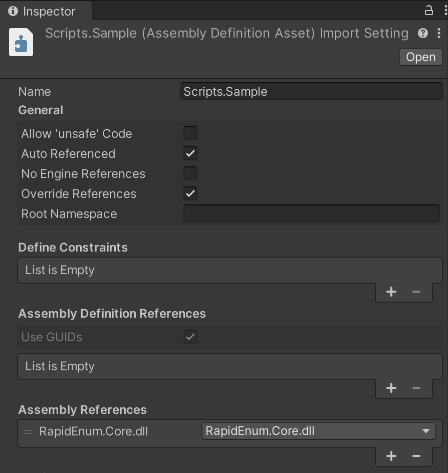

# RapidEnum

[English](README.md)

RapidEnum は、C#/.NET 用の高速に動作する列挙型ユーティリティを提供するソースジェネレーターです。[.NET 標準の API](https://learn.microsoft.com/en-us/dotnet/api/system.enum?view=net-8.0)よりも高速で、全てのメソッドでゼロアロケーションを達成しています。

**Package - [RapidEnum](https://www.nuget.org/packages/RapidEnum)**


.NET 標準の API よりもかなりパフォーマンスが向上されています。また[FastEnum v1.8.0](https://github.com/xin9le/FastEnum/releases/tag/v1.8.0)よりも高速で動作します。パフォーマンス比較の詳細は[こちら](#パフォーマンス比較)を参照してください。

RapidEnum は[FastEnum](https://github.com/xin9le/FastEnum)に多大の影響を受けています。API は FastEnum に非常に似ています。素晴らしいライブラリを作成してくださった[xin9le](https://github.com/xin9le)さんに感謝しています！

# 目次

- [要件](#要件)
- [インストール](#インストール)
  - [NuGet](#NuGet)
  - [Unity](#Unity)
	- [asmdefの設定](#asmdefの設定)
- [使い方](#使い方)
  - [基本的な使い方](#基本的な使い方)
  - [任意の列挙型に利用する方法](#任意の列挙型に利用する方法)
- [パフォーマンス比較](#パフォーマンス比較)

# 要件

- .NET Standard2.0 以上
- Unity 2022.3.12f1 以上

# インストール

## NuGet

```shell
$ dotnet add package RapidEnum
```

**nuget.org : [RapidEnum](https://www.nuget.org/packages/RapidEnum)**

## Unity

Package Manager から下記 git URL を追加してください。

```
https://github.com/hanachiru/RapidEnum.git?path=/RapidEnum.Unity/Packages/com.hanachiru.rapidenum
```


### asmdefの設定
`.asmdef`を作成していない場合は下記は関係ありません。

`.asmdef`の`Override References`をオンにしている場合には、`Assembly References`に`RapidEnum.Core.dll`を追加する必要があります。



# 使い方

## 基本的な使い方

対象の列挙型に`[RapidEnum]`属性を付けると、列挙型ユーティリティクラスが生成されます。このとき`public`か`internal`の列挙型に対してのみ有効なので注意してください。

```csharp
[RapidEnum]
public enum Weather
{
    Sun,
    Cloud,
    Rain,
    Snow
}
```

`[RapidEnum]`属性を付与した列挙型に対応する、`列挙型名 + EnumExtensions`クラスに関連メソッドが定義されます。

```csharp
// Sun,Cloud,Rain,Snow
IReadOnlyList<Weather> values = WeatherEnumExtensions.GetValues();

// Sun,Cloud,Rain,Snow
IReadOnlyList<string> names = WeatherEnumExtensions.GetNames();

// Rain
string name = WeatherEnumExtensions.GetName(Weather.Rain);

// Cloud
string str = Weather.Cloud.ToStringFast();

// True
bool defined = WeatherEnumExtensions.IsDefined("Sun");

// Sun
Weather parse = WeatherEnumExtensions.Parse("Sun");

// True
// Sun
bool tryParse = WeatherEnumExtensions.TryParse("Sun", out Weather value);
```

## 任意の列挙型に利用する方法

`[RapidEnum]`属性を列挙型に付与する以外にも、`[RapidEnumWithType]`属性を利用することで、任意の列挙型に対してユーティリティクラスを生成することができます。

`public`か`internal`である`static partial class`に対して、引数に対象の列挙型を指定した`[RapidEnumWithType]`属性を付与してください。このときクラス名は任意の文字列で大丈夫ですが、`列挙型名 + EnumExtensions`だと分かりやすいです。

```csharp
// System.DateTimeKind has Unspecified, Utc, Local
[RapidEnumWithType(typeof(DateTimeKind))]
public static partial class DateTimeKindEnumExtensions
{
}
```

`[RapidEnum]`を利用した場合と比べてパフォーマンスに差があるわけではありません。サードパーティ製のライブラリが提供する列挙型など、`[RapidEnum]`が付与できない場合は`[RapidEnumWithType]`を利用してください。

```csharp
// Unspecified,Utc,Local
IReadOnlyList<DateTimeKind> values = DateTimeKindEnumExtensions.GetValues();

// Unspecified,Utc,Local
IReadOnlyList<string> names = DateTimeKindEnumExtensions.GetNames();

// Local
string name = DateTimeKindEnumExtensions.GetName(DateTimeKind.Local);

// Local
string str = DateTimeKind.Local.ToStringFast();

// True
bool defined = DateTimeKindEnumExtensions.IsDefined("Local");

// Local
DateTimeKind parse = DateTimeKindEnumExtensions.Parse("Local");

// True
// Local
bool tryParse = DateTimeKindEnumExtensions.TryParse("Local", out DateTimeKind value);
```

## Name と Value をペアで取得する

列挙型の Name と Value をペアで取得したい場合は、`GetMembers`メソッドや`GetMember`メソッドを利用してください。

```csharp
WeatherEnumExtensions.Member member = WeatherEnumExtensions.GetMember(Weather.Rain);
var (name, value) = member;

foreach (WeatherEnumExtensions.Member item in WeatherEnumExtensions.GetMembers())
{
    Console.WriteLine($"Name : {item.Name}, Value : {item.Value}");
}
```

# パフォーマンス比較

| Method              |       Mean |     Error |    StdDev |     Median |   Gen0 | Allocated |
| ------------------- | ---------: | --------: | --------: | ---------: | -----: | --------: |
| RapidEnum_GetValues |  0.0042 ns | 0.0059 ns | 0.0052 ns |  0.0028 ns |      - |         - |
| FastEnum_GetValues  |  0.0083 ns | 0.0086 ns | 0.0081 ns |  0.0055 ns |      - |         - |
| NET_GetValues       | 64.4620 ns | 0.9908 ns | 0.9268 ns | 64.2767 ns | 0.0048 |      40 B |
| RapidEnum_GetNames  |  0.0006 ns | 0.0017 ns | 0.0015 ns |  0.0000 ns |      - |         - |
| FastEnum_GetNames   |  0.0025 ns | 0.0031 ns | 0.0028 ns |  0.0012 ns |      - |         - |
| NET_GetNames        | 12.3820 ns | 0.1086 ns | 0.1016 ns | 12.4076 ns | 0.0067 |      56 B |
| RapidEnum_GetName   |  0.0069 ns | 0.0085 ns | 0.0071 ns |  0.0039 ns |      - |         - |
| FastEnum_GetName    |  0.2530 ns | 0.0070 ns | 0.0065 ns |  0.2527 ns |      - |         - |
| NET_GetName         | 15.9190 ns | 0.0524 ns | 0.0490 ns | 15.9046 ns | 0.0029 |      24 B |
| RapidEnum_ToString  |  0.0103 ns | 0.0049 ns | 0.0046 ns |  0.0110 ns |      - |         - |
| FastEnum_ToString   |  0.4844 ns | 0.0062 ns | 0.0052 ns |  0.4845 ns |      - |         - |
| NET_ToString        |  6.1700 ns | 0.0451 ns | 0.0376 ns |  6.1493 ns | 0.0029 |      24 B |
| RapidEnum_IsDefines |  0.0026 ns | 0.0036 ns | 0.0034 ns |  0.0000 ns |      - |         - |
| FastEnum_IsDefines  |  4.6724 ns | 0.0583 ns | 0.0545 ns |  4.6434 ns |      - |         - |
| NET_IsDefines       | 14.5923 ns | 0.0355 ns | 0.0332 ns | 14.5996 ns |      - |         - |
| RapidEnum_Parse     |  0.9258 ns | 0.0161 ns | 0.0150 ns |  0.9240 ns |      - |         - |
| FastEnum_Parse      |  4.6223 ns | 0.0082 ns | 0.0073 ns |  4.6192 ns |      - |         - |
| NET_Parse           |  8.8707 ns | 0.0965 ns | 0.0903 ns |  8.8293 ns |      - |         - |
| RapidEnum_TryParse  |  0.7633 ns | 0.0097 ns | 0.0090 ns |  0.7657 ns |      - |         - |
| FastEnum_TryParse   |  4.6869 ns | 0.0254 ns | 0.0212 ns |  4.6852 ns |      - |         - |
| NET_TryParse        |  8.8433 ns | 0.0609 ns | 0.0569 ns |  8.8268 ns |      - |         - |


[Benchmark Source](https://github.com/hanachiru/RapidEnum/tree/main/RapidEnum.Benchmark)

```
BenchmarkDotNet v0.14.0, macOS Sonoma 14.4.1 (23E224) [Darwin 23.4.0]
Apple M2 Pro, 1 CPU, 12 logical and 12 physical cores
.NET SDK 8.0.303
[Host]     : .NET 8.0.7 (8.0.724.31311), Arm64 RyuJIT AdvSIMD
DefaultJob : .NET 8.0.7 (8.0.724.31311), Arm64 RyuJIT AdvSIMD
```
