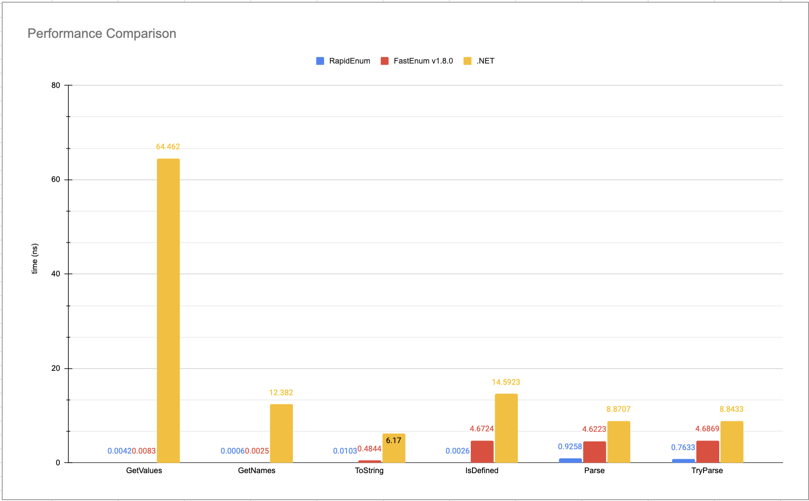

# RapidEnum

[日本語版](README.jp.md)

RapidEnum is a Source Generator that provides fast-running enum utilities for C#/.NET. It is faster than the [.NET functions](https://learn.microsoft.com/en-us/dotnet/api/system.enum?view=net-8.0) and achieves zero allocation for all methods.

**Package - [RapidEnum](https://www.nuget.org/packages/RapidEnum)**

It performed better than the standard API. It is also faster than [FastEnum v1.8.0](https://github.com/xin9le/FastEnum/releases/tag/v1.8.0). For more information on performance comparisons, see [this]().

RapidEnum is heavily influenced by [FastEnum](https://github.com/xin9le/FastEnum). API is very similar to FastEnum. Thanks to [xin9le](https://github.com/xin9le) for creating a great library!

# RapidEnum
